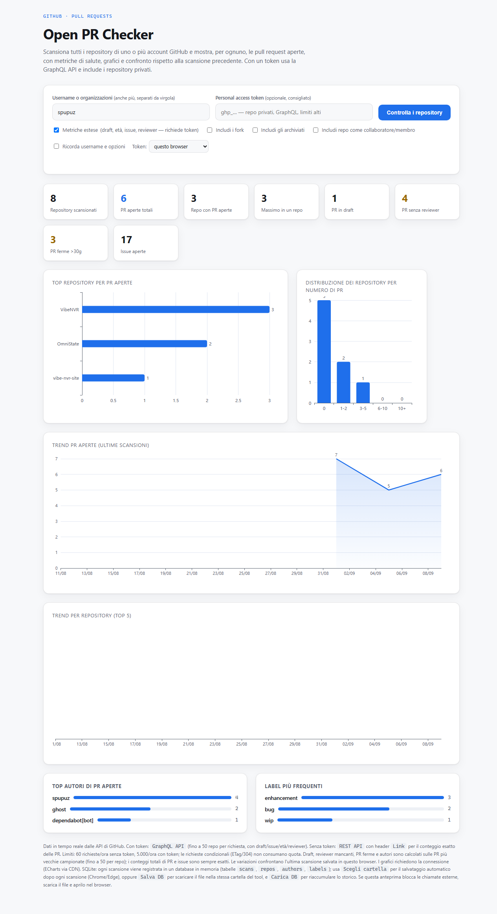

# GitHub Open PR Checker

**CheckGitHubRepo** — a self-contained, single-file, browser-based web tool (interface in **Italian**) that scans one or more GitHub accounts/organizations and shows, for each repository, the **open pull requests** with health metrics, charts, historical trends, and comparison against the previous scan.

There is **no server, no build step, and no package manager** — just open `github_pr_checker.html` in a browser.

> ### Screenshot
>
> 

## Features

- Scan multiple GitHub users/orgs (comma-separated).
- **Two GitHub API modes:**
  - **REST API (no token):** exact open-PR count per repo via the `Link` header (~60 req/hour limit).
  - **GraphQL API (with a personal access token):** up to 50 repos per request, includes **private repos**, and supports extended metrics (draft PRs, open issues, PR age, reviewers, labels). ~5,000 req/hour limit.
- **Extended metrics** (token): draft PRs, PRs without reviewer, stale PRs (>30 days), oldest PR age, open issues, stars, last update.
- **Charts** (ECharts via CDN):
  - Top repositories by open PRs.
  - Distribution of repositories by PR count.
  - **Historical trend of open PRs** across past scans (line chart).
  - **Per-repository trend** (top 5) over time.
- **Aggregations:** top PR authors and most frequent labels.
- **Delta view:** variation vs. the previous scan (snapshot kept in `localStorage`).
- **Exports:** CSV and JSON download.
- **SQLite persistence** (via `sql.js`/WASM in-browser): every scan is recorded in an in-browser SQLite DB (tables `scans`, `repos`, `authors`, `labels`), with auto-save to a picked folder, manual DB download/load.
- Conditional caching (ETag/304), rate-limit monitoring, token diagnostics, sortable/filterable results table, shareable URL hash, light/dark theme, print-to-PDF support.

## Usage

1. Open `github_pr_checker.html` in Chrome or Edge (Firefox may block external API calls in restricted contexts — download the file and open it directly).
2. Enter one or more GitHub usernames/orgs.
3. (Optional) Paste a GitHub personal access token to enable private repos and extended metrics.
4. Click scan. Charts require network access (ECharts is loaded from CDN).

Your token is stored only in your browser (`localStorage`/`sessionStorage` under `ghPrChecker.token`) — it is never sent to any server other than GitHub's APIs.

## Development

- The **entire application** is `github_pr_checker.html` (HTML + CSS + ES6 in one IIFE, ~1,000 lines). Keep it as the single source of truth.
- No dependencies to install; CDN deps are pinned: `echarts@5`, `sql.js@1.8.0`.
- Commit messages follow **conventional commits** (`feat:`, `fix:`, `fix(ui):`, `refactor:`, `chore:`, `docs:`, `security:`).
- UI copy and labels are **Italian** — keep new strings in Italian.
- Releases are **Git-Tag driven** and managed via the `commit-push` / `release-prs` opencode skills (see CONTEXT.md).

## Requirements

- A modern browser (Chrome/Edge recommended for File System Access API / SQLite auto-save).
- `gh` + `git` and `node`/`python3` if you use the release skills locally.
- No token required for basic (REST) scans; a GitHub PAT enables GraphQL + private repos.

## Security

No secrets are included in the source. The personal token is entered by the user at runtime and stored exclusively in `localStorage`/`sessionStorage`. Generated SQLite files are excluded from version control (`.gitignore`).

## License

See the repository's license (if any).
